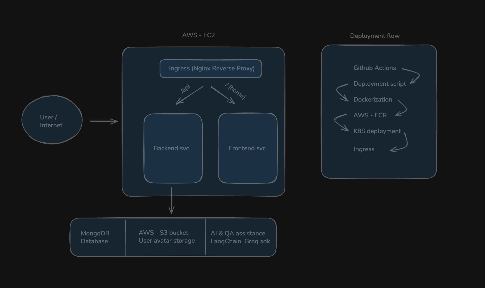

# CloudProfile

**A production-style full-stack AI-powered web application built with the MERN stack, containerized with Docker, deployed on AWS EC2, and automated with GitLab CI/CD.**

> Built as a portfolio project to demonstrate real-world DevOps and cloud engineering skills including containerization, cloud deployment, SSL configuration, CI/CD automation, and Kubernetes orchestration.

---

## Table of Contents

- [Project Overview](#project-overview)
- [Tech Stack](#tech-stack)
- [Architecture Overview](#architecture-overview)
- [Repository Structure](#repository-structure)
- [Backend Documentation](#backend-documentation)
- [Frontend Documentation](#frontend-documentation)
- [Environment Variables](#environment-variables)
- [CI/CD Pipeline](#cicd-pipeline)
- [AWS Deployment](#aws-deployment)
- [Kubernetes Deployment](#kubernetes-deployment)
- [Screenshots](#screenshots)
- [DevOps Skills Demonstrated](#devops-skills-demonstrated)
- [Resume-Ready Project Description](#resume-ready-project-description)

---

## Project Overview

CloudProfile is a full-stack web application that allows users to create and manage their professional profiles. It includes an AI-powered Q&A assistant (built with LangChain and Groq) that can answer questions about the project itself. The application is fully containerized, hosted on AWS, secured with HTTPS, and deployed through an automated CI/CD pipeline.

This project was built to simulate a real production environment and demonstrate practical DevOps and cloud engineering skills.

---

## Tech Stack

| Layer            | Technology                 |
| ---------------- | -------------------------- |
| Frontend         | React (Vite), Tailwind CSS |
| Backend          | Node.js, Express.js, TS    |
| Database         | MongoDB                    |
| AI Integration   | LangChain, Groq            |
| File Storage     | Amazon S3                  |
| Containerization | Docker, Amazon ECR         |
| Hosting          | Amazon EC2                 |
| Reverse Proxy    | NGINX, Ingress             |
| SSL/HTTPS        | Certbot (Let's Encrypt)    |
| CI/CD            | GitLab CI/CD               |
| Orchestration    | Kubernetes                 |

---

## Architecture Diagram

## 

## Repository Structure

```
cloudprofile/
├── backend/                    # Node.js + Express API server
│   ├── controllers/            # Route handler logic
│   ├── models/                 # Mongoose schemas
│   ├── routes/                 # API route definitions
│   ├── middleware/             # Auth and error handling middleware
│   ├── config/                 # DB and app configuration
│   ├── Dockerfile              # Backend container definition
│   ├── .env.example            # Environment variable template
│   └── package.json
│
├── frontend/                   # React app (Vite)
│   ├── src/
│   │   ├── components/         # Reusable UI components
│   │   ├── pages/              # Page-level components
│   │   ├── hooks/              # Custom React hooks
│   │   └── utils/              # Utility functions
│   ├── public/
│   ├── Dockerfile              # Frontend container definition
│   ├── nginx.conf              # NGINX config inside frontend container
│   ├── .env.example
│   └── package.json
│
├── k8s/                        # Kubernetes manifests
│   ├── backend-deployment.yaml # Backend Deployment + Service
│   ├── frontend-deployment.yaml # Frontend Deployment + Service
│   └── ingress.yaml            # Ingress resource for routing
│
├── .github/worflow/            # Github Action CI/CD pipeline definition
│   ├── backend.yaml
│   ├── frontend.yaml
├── assets/                     # Reference screenshots
└── README.md                   # This file
```

---

## Backend Documentation

### Overview

The backend is a REST API built with Node.js and Express. It handles user authentication, profile management, avatar uploads to S3, and AI-powered Q&A via LangChain and Groq.

### Key Features

- JWT-based user authentication
- User profile CRUD operations
- Avatar upload to Amazon S3 using `multer` and `@aws-sdk/client-s3`
- AI Q&A assistant powered by LangChain and Groq
- MongoDB integration using Mongoose
- Input validation and centralized error handling

### API Endpoints

| Method | Endpoint             | Description                     | Auth Required |
| ------ | -------------------- | ------------------------------- | ------------- |
| POST   | `/api/auth/register` | Register a new user             | No            |
| POST   | `/api/auth/login`    | Login and receive JWT           | No            |
| GET    | `/api/users/profile` | Get current user profile        | Yes           |
| PUT    | `/api/users/profile` | Update user profile             | Yes           |
| POST   | `/api/users/avatar`  | Upload avatar to S3             | Yes           |
| POST   | `/api/ai/ask`        | Ask the AI assistant a question | Yes           |

### Running Locally

```bash
cd backend
cp .env.example .env
# Fill in your environment variables
npm install
npm run dev
```

### Dockerfile — Backend

```dockerfile
FROM node:20-alpine
WORKDIR /app
COPY package*.json ./
RUN npm install --production
COPY . .
EXPOSE 5000
CMD ["node", "server.js"]
```

The backend image is built, tagged, and pushed to Amazon ECR by the CI/CD pipeline. On EC2, it runs as a Docker container on port `5000` and is proxied through NGINX.

---

## Frontend Documentation

### Overview

The frontend is a React application built with Vite and styled using Tailwind CSS. It communicates with the backend API and includes an AI chat interface for the project Q&A assistant.

### Key Features

- Fast build and hot reload with Vite
- Responsive UI with Tailwind CSS
- User authentication (login/register)
- Profile creation and editing with avatar upload
- AI assistant chat window

### Running Locally

```bash
cd frontend
cp .env.example .env
# Set VITE_API_URL to your backend URL
npm install
npm run dev
```

### Dockerfile — Frontend

```dockerfile
FROM node:20-alpine AS build
WORKDIR /app
COPY package*.json ./
RUN npm install
COPY . .
RUN npm run build

FROM nginx:alpine
COPY --from=build /app/dist /usr/share/nginx/html
COPY nginx.conf /etc/nginx/conf.d/default.conf
EXPOSE 80
CMD ["nginx", "-g", "daemon off;"]
```

The frontend uses a multi-stage Docker build. The first stage builds the React app and the second stage serves the static output using NGINX inside the container. This keeps the final image small and production-ready.

### NGINX Config Inside Frontend Container

```nginx
server {
    listen 80;
    location / {
        root /usr/share/nginx/html;
        index index.html;
        try_files $uri /index.html;
    }
}
```

This handles client-side routing by redirecting all requests to `index.html`.

---

## Environment Variables

### Backend — `.env`

```env
# Server
PORT=5000
NODE_ENV=production

# MongoDB
MONGO_URI=mongodb+srv://<user>:<password>@cluster.mongodb.net/cloudprofile

# JWT
JWT_SECRET=your_jwt_secret_key
JWT_EXPIRES_IN=7d

# Amazon S3
AWS_ACCESS_KEY_ID=your_aws_access_key
AWS_SECRET_ACCESS_KEY=your_aws_secret_key
AWS_REGION=us-east-1
S3_BUCKET_NAME=cloudprofile-avatars

# Groq AI
GROQ_API_KEY=your_groq_api_key
```

### Frontend — `.env`

```env
# Backend API base URL
VITE_API_URL=https://your-domain.com/api
```

> **Security Note:** Never commit `.env` files to version control. Use `.env.example` files as templates and store actual secrets in GitLab CI/CD variables or AWS Secrets Manager.

---

## CI/CD Pipeline

The CI/CD pipeline is defined in `.gitlab-ci.yml` and runs automatically on every push to the `main` branch.

### Pipeline Stages

```
┌──────────┐     ┌──────────┐     ┌──────────┐     ┌──────────┐
│  build   │────►│   push   │────►│  deploy  │────►│  verify  │
└──────────┘     └──────────┘     └──────────┘     └──────────┘
```

### Stage-by-Stage Breakdown

**Stage 1 — build**

- GitLab runner checks out the latest code
- Builds the Docker image for the backend using `docker build`
- Builds the Docker image for the frontend using `docker build`
- Tags each image with the GitLab commit SHA for traceability

**Stage 2 — push**

- Authenticates to Amazon ECR using AWS credentials stored in GitLab CI/CD variables
- Pushes the backend and frontend Docker images to their respective ECR repositories
- Also tags images with `latest` for easy reference

**Stage 3 — deploy**

- SSH's into the EC2 instance using a private key stored as a GitLab CI/CD variable
- Authenticates Docker on EC2 to pull from ECR
- Pulls the latest backend and frontend images
- Stops and removes old containers
- Starts new containers with the updated images and correct environment variables

**Stage 4 — verify**

- Sends an HTTP request to the application's health check endpoint to confirm the deployment succeeded
- Fails the pipeline if the app is not responding

### `.gitlab-ci.yml` Overview

```yaml
stages:
  - build
  - push
  - deploy
  - verify

variables:
  BACKEND_IMAGE: $AWS_ACCOUNT_ID.dkr.ecr.$AWS_REGION.amazonaws.com/cloudprofile-backend
  FRONTEND_IMAGE: $AWS_ACCOUNT_ID.dkr.ecr.$AWS_REGION.amazonaws.com/cloudprofile-frontend

build:
  stage: build
  script:
    - docker build -t $BACKEND_IMAGE:$CI_COMMIT_SHA ./backend
    - docker build -t $FRONTEND_IMAGE:$CI_COMMIT_SHA ./frontend

push:
  stage: push
  script:
    - aws ecr get-login-password --region $AWS_REGION | docker login --username AWS --password-stdin $ECR_REGISTRY
    - docker push $BACKEND_IMAGE:$CI_COMMIT_SHA
    - docker push $FRONTEND_IMAGE:$CI_COMMIT_SHA

deploy:
  stage: deploy
  script:
    - ssh -i $EC2_KEY ec2-user@$EC2_HOST "docker pull $BACKEND_IMAGE:latest && docker-compose up -d"

verify:
  stage: verify
  script:
    - curl -f https://your-domain.com/api/health
```

### GitLab CI/CD Variables Required

| Variable                | Description                                |
| ----------------------- | ------------------------------------------ |
| `AWS_ACCESS_KEY_ID`     | AWS IAM access key                         |
| `AWS_SECRET_ACCESS_KEY` | AWS IAM secret key                         |
| `AWS_REGION`            | AWS region (e.g., `us-east-1`)             |
| `AWS_ACCOUNT_ID`        | Your 12-digit AWS account ID               |
| `EC2_HOST`              | Public IP or DNS of EC2 instance           |
| `EC2_KEY`               | Private SSH key for EC2 access (file type) |

---

## AWS Deployment

This section explains how the application is deployed and configured on AWS.

### Services Used

| Service | Purpose                                              |
| ------- | ---------------------------------------------------- |
| EC2     | Hosts the Docker containers for frontend and backend |
| ECR     | Stores Docker images for frontend and backend        |
| S3      | Stores user avatar images                            |

### EC2 Setup

The EC2 instance runs Ubuntu 22.04 LTS. The following are installed on the instance:

- Docker and Docker Compose
- NGINX
- Certbot (for SSL)
- AWS CLI (for ECR authentication)

### NGINX as Reverse Proxy

NGINX listens on ports 80 and 443 and proxies traffic to the appropriate container.

```nginx
server {
    listen 443 ssl;
    server_name your-domain.com;

    ssl_certificate /etc/letsencrypt/live/your-domain.com/fullchain.pem;
    ssl_certificate_key /etc/letsencrypt/live/your-domain.com/privkey.pem;

    # Route /api/* to the backend container
    location /api/ {
        proxy_pass http://localhost:5000;
        proxy_set_header Host $host;
        proxy_set_header X-Real-IP $remote_addr;
    }

    # Route everything else to the frontend container
    location / {
        proxy_pass http://localhost:3000;
        proxy_set_header Host $host;
    }
}

# Redirect HTTP to HTTPS
server {
    listen 80;
    server_name your-domain.com;
    return 301 https://$host$request_uri;
}
```

### SSL with Certbot

SSL certificates are issued by Let's Encrypt and managed by Certbot.

```bash
# Install Certbot
sudo apt install certbot python3-certbot-nginx

# Issue certificate (auto-configures NGINX)
sudo certbot --nginx -d your-domain.com

# Auto-renewal is handled by a cron job
sudo certbot renew --dry-run
```

### Amazon S3 — Avatar Storage

User profile avatars are uploaded directly from the backend to a private S3 bucket. The backend generates a pre-signed URL for secure upload, or uploads the file server-side using the AWS SDK.

S3 bucket configuration:

- Block all public access: enabled
- Objects accessed via pre-signed URLs or CloudFront (optional)
- IAM policy on the backend EC2 role grants `s3:PutObject` and `s3:GetObject` to the bucket

### Amazon ECR — Container Registry

Each application has its own ECR repository:

- `cloudprofile-backend`
- `cloudprofile-frontend`

Images are tagged with both `latest` and the Git commit SHA. The pipeline authenticates using:

```bash
aws ecr get-login-password --region us-east-1 | \
  docker login --username AWS --password-stdin \
  <account_id>.dkr.ecr.us-east-1.amazonaws.com
```

---

## Kubernetes Deployment

Kubernetes manifests are included in the `k8s/` folder. These are written for environments like Amazon EKS, Minikube, or any standard Kubernetes cluster.

### Manifest Structure

```
k8s/
├── backend-deployment.yaml    # Backend Deployment + ClusterIP Service
├── frontend-deployment.yaml   # Frontend Deployment + ClusterIP Service
└── ingress.yaml               # Ingress resource (routes traffic by path)
```

### Backend — `backend-deployment.yaml`

This file contains both the Deployment and Service for the backend in one file.

```yaml
apiVersion: apps/v1
kind: Deployment
metadata:
  name: cloudprofile-backend
spec:
  replicas: 2
  selector:
    matchLabels:
      app: backend
  template:
    metadata:
      labels:
        app: backend
    spec:
      containers:
        - name: backend
          image: <ecr_url>/cloudprofile-backend:latest
          ports:
            - containerPort: 5000
          envFrom:
            - secretRef:
                name: backend-secrets
---
apiVersion: v1
kind: Service
metadata:
  name: backend-service
spec:
  selector:
    app: backend
  ports:
    - port: 5000
      targetPort: 5000
  type: ClusterIP
```

### Frontend — `frontend-deployment.yaml`

```yaml
apiVersion: apps/v1
kind: Deployment
metadata:
  name: cloudprofile-frontend
spec:
  replicas: 2
  selector:
    matchLabels:
      app: frontend
  template:
    metadata:
      labels:
        app: frontend
    spec:
      containers:
        - name: frontend
          image: <ecr_url>/cloudprofile-frontend:latest
          ports:
            - containerPort: 80
---
apiVersion: v1
kind: Service
metadata:
  name: frontend-service
spec:
  selector:
    app: frontend
  ports:
    - port: 80
      targetPort: 80
  type: ClusterIP
```

### Ingress — `ingress.yaml`

The Ingress routes traffic to the correct service based on the URL path.

```yaml
apiVersion: networking.k8s.io/v1
kind: Ingress
metadata:
  name: cloudprofile-ingress
  annotations:
    nginx.ingress.kubernetes.io/rewrite-target: /
spec:
  rules:
    - host: your-domain.com
      http:
        paths:
          - path: /api
            pathType: Prefix
            backend:
              service:
                name: backend-service
                port:
                  number: 5000
          - path: /
            pathType: Prefix
            backend:
              service:
                name: frontend-service
                port:
                  number: 80
```

### Applying the Manifests

```bash
# Apply all manifests
kubectl apply -f k8s/

# Check status
kubectl get pods
kubectl get services
kubectl get ingress

# View logs
kubectl logs deployment/cloudprofile-backend
kubectl logs deployment/cloudprofile-frontend
```

---

## Screenshots

> Place all screenshots in the `screenshots/` folder and update the paths below.

### 1. Home / Landing Page


_The landing page with navigation and call-to-action._

### 2. User Registration


_User registration form with validation._

### 3. User Profile Page


_Logged-in user viewing and editing their profile._

### 4. Avatar Upload


_Profile picture upload — stored in Amazon S3._

### 5. AI Assistant Chat


_The project Q&A assistant powered by LangChain and Groq._

### 6. GitLab CI/CD Pipeline


_A successful GitLab pipeline run showing all stages._

### 7. Amazon ECR — Docker Images


_Backend and frontend images stored in Amazon ECR._

### 8. EC2 Instance


_Running EC2 instance hosting the application._

### 9. Architecture Diagram


_Full system architecture diagram._

---

## DevOps Skills Demonstrated

This project covers the core skills expected of a junior DevOps or Cloud Engineer.

### Containerization

- Wrote production-ready Dockerfiles for both frontend and backend
- Used multi-stage builds to keep images small
- Managed container lifecycle with Docker Compose on EC2

### Container Registry

- Created and managed repositories in Amazon ECR
- Tagged images with commit SHAs for deployment traceability
- Automated image push through the CI/CD pipeline

### Cloud Infrastructure

- Provisioned and configured an Amazon EC2 instance
- Configured security groups to allow HTTP, HTTPS, and SSH
- Connected EC2 to S3 and ECR with proper IAM roles and policies
- Used Amazon S3 for scalable, durable file storage

### Networking and Reverse Proxy

- Configured NGINX as a reverse proxy to route traffic between frontend and backend containers
- Managed HTTP to HTTPS redirects
- Set correct proxy headers for forwarding client IP and host information

### SSL / TLS

- Issued SSL certificates using Certbot and Let's Encrypt
- Configured auto-renewal to avoid certificate expiry
- Enabled HTTPS across the full application stack

### CI/CD Automation

- Built a multi-stage GitLab CI/CD pipeline
- Stored secrets securely as GitLab CI/CD variables
- Automated Docker build, push to ECR, SSH-based deployment, and health check verification

### Kubernetes

- Wrote Deployment and Service manifests for frontend and backend
- Wrote a separate Ingress manifest for path-based routing
- Structured manifests to be portable across EKS, GKE, or any standard cluster

### Infrastructure as Code Mindset

- All configuration is defined in code (Dockerfiles, NGINX config, CI/CD YAML, K8s manifests)
- Reproducible deployments from a clean EC2 instance
- Environment-specific configuration managed through environment variables

---

## Resume-Ready Project Description

Use this as a bullet point list or short paragraph in your resume or LinkedIn profile.

---

**CloudProfile — Full-Stack AI Web Application | AWS, Docker, GitLab CI/CD**

- Built and deployed a production-style MERN stack application with AI integration using LangChain and Groq on Amazon EC2
- Containerized frontend (React/Vite) and backend (Node.js/Express) using Docker with multi-stage builds; stored images in Amazon ECR
- Configured NGINX as a reverse proxy with SSL/HTTPS using Certbot and Let's Encrypt
- Implemented a GitLab CI/CD pipeline to automate Docker image builds, pushes to ECR, and SSH-based deployments on every commit to main
- Integrated Amazon S3 for scalable user avatar storage with IAM-based access control
- Wrote Kubernetes manifests (Deployment, Service, Ingress) for a portable, cloud-native deployment option
- Applied DevOps best practices including secret management via CI/CD variables, health check verification, and infrastructure-as-code configuration

---

_CloudProfile — Built to learn and demonstrate real-world DevOps and cloud engineering practices._
